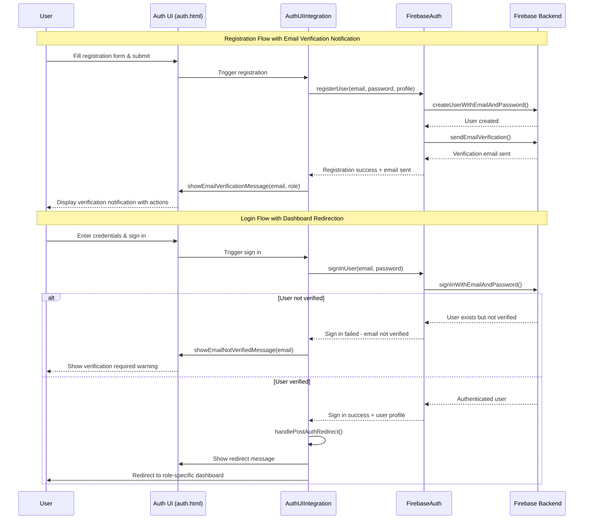
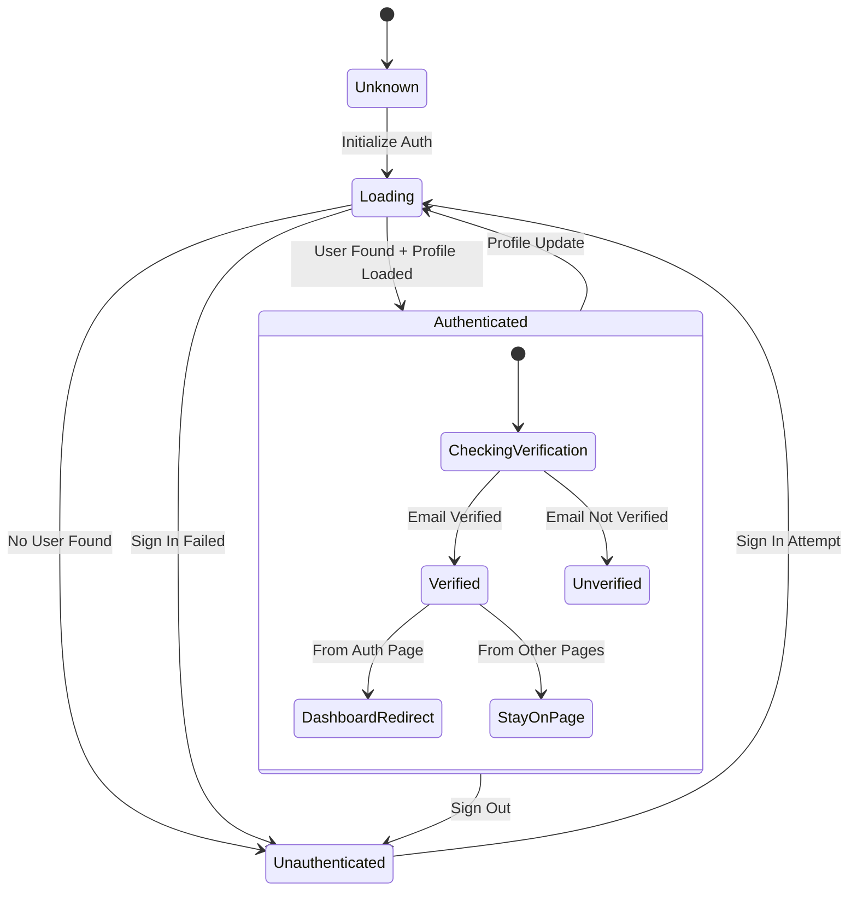

# Technical Design Document

## Overview

This design addresses two critical user experience issues in the MentorBridge platform's authentication flow:

1. **Email Verification UI Notifications**: Users currently receive email verification confirmation only in the browser console, not in the visible UI, leading to confusion and incomplete registration flows.

2. **Post-Login Dashboard Redirection**: After successful login, users are not automatically redirected to their role-specific dashboard, requiring manual navigation and creating a poor user experience.

The solution implements comprehensive UI notification management and intelligent post-authentication routing to create a seamless authentication experience. The design follows the existing Firebase-based authentication architecture while enhancing the UI integration layer to provide clear user feedback and automatic navigation.

## Architecture

### System Component Overview

The authentication flow enhancement leverages the existing three-layer architecture:

1. **Firebase Authentication Layer** (`firebase-auth.js`): Handles actual authentication operations
2. **UI Integration Layer** (`auth-ui-integration.js`): Manages UI updates and state synchronization  
3. **Presentation Layer** (`auth.html`): Provides the user interface elements

### Component Interaction Flow



### Authentication State Management

The authentication state flows through a centralized state machine:



## Components and Interfaces

### Enhanced AuthUIIntegrationService

**Location**: `/public/js/auth-ui-integration.js`

**New Methods**:

```typescript
interface AuthUIIntegrationService {
  // Email Verification Notifications
  showEmailVerificationMessage(email: string, role: string): void;
  showEmailNotVerifiedMessage(email: string, canResend: boolean): void;
  
  // Dashboard Redirection
  handlePostAuthRedirect(): void;
  getDashboardUrlForRole(role: string): string;
  
  // UI State Management
  clearPreviousMessages(): void;
  setLoadingState(operation: string, message?: string): void;
  clearLoadingState(operation?: string): void;
  
  // Enhanced Error Handling
  showErrorWithActions(message: string, actions: UIAction[]): void;
  validateNotificationPlacement(): boolean;
}

interface UIAction {
  label: string;
  action: () => void;
  style: 'primary' | 'secondary' | 'danger';
}
```

**Enhanced Properties**:

```typescript
class AuthUIIntegrationService {
  private notificationQueue: NotificationMessage[];
  private redirectConfig: RoleRedirectConfig;
  private uiStateManager: UIStateManager;
}

interface NotificationMessage {
  id: string;
  type: 'success' | 'error' | 'warning' | 'info';
  content: string | HTMLElement;
  actions: UIAction[];
  persistent: boolean;
  timestamp: Date;
}

interface RoleRedirectConfig {
  student: string;
  mentor: string; 
  admin: string;
  default: string;
}
```

### Email Verification Notification Component

**Integrated into**: `auth.html` via `AuthUIIntegrationService`

**Structure**:
```html
<div class="email-verification-notification" role="alert">
  <div class="notification-header">
    <span class="success-icon">✅</span>
    <h4>Account Created Successfully!</h4>
  </div>
  <div class="notification-body">
    <p>We've sent a verification email to <strong>{email}</strong>.</p>
    <p>Next steps:</p>
    <ol>
      <li>Check your email (including spam folder)</li>
      <li>Click the verification link</li>
      <li>Return here and sign in to access your {role} dashboard</li>
    </ol>
  </div>
  <div class="notification-actions">
    <button class="btn btn-success btn-sm" id="resendVerificationBtn">
      Resend Verification Email
    </button>
    <button class="btn btn-outline btn-sm" onclick="switchToSignIn()">
      Go to Sign In
    </button>
  </div>
</div>
```

**Styling** (added to `components.css`):
```css
.email-verification-notification {
  background: rgba(35,138,83,.1);
  border: 1px solid rgba(35,138,83,.2);
  border-radius: 10px;
  padding: 1rem;
  margin: 1rem 0;
  animation: slideDown 0.3s ease-out;
}

.notification-header {
  display: flex;
  align-items: center;
  gap: 0.75rem;
  margin-bottom: 0.75rem;
}

.notification-header h4 {
  color: #238a53;
  margin: 0;
  font-size: 1rem;
}

.notification-body {
  color: #238a53;
  font-size: 0.875rem;
  line-height: 1.5;
  margin-bottom: 1rem;
}

.notification-body ol {
  margin: 0.5rem 0 0 1rem;
  padding: 0;
}

.notification-actions {
  display: flex;
  gap: 0.5rem;
  flex-wrap: wrap;
}
```

### Dashboard Redirection Service

**Integration Points**:

1. **AuthUIIntegrationService.handlePostAuthRedirect()**:
   ```javascript
   async handlePostAuthRedirect() {
     const currentPath = window.location.pathname;
     
     // Only redirect from auth pages
     if (!this.isAuthPage(currentPath)) {
       return;
     }
     
     const role = this.userProfile?.role || 'student';
     const dashboardUrl = this.getDashboardUrlForRole(role);
     
     // Show redirect message
     this.showSuccessMessage(`Welcome back! Redirecting to your ${this.formatRoleForDisplay(role)} dashboard...`);
     
     // Preserve URL parameters if needed
     const urlParams = new URLSearchParams(window.location.search);
     const finalUrl = this.appendUrlParams(dashboardUrl, urlParams);
     
     // Redirect after delay for UX
     setTimeout(() => {
       window.location.href = finalUrl;
     }, 1500);
   }
   ```

2. **Role-Based URL Mapping**:
   ```javascript
   getDashboardUrlForRole(role) {
     const dashboardMap = {
       student: '/pages/student-dashboard.html',
       mentor: '/pages/mentor-dashboard.html', 
       admin: '/pages/admin-dashboard.html'
     };
     
     return dashboardMap[role] || dashboardMap.student;
   }
   ```

### Error Handling Enhancement

**Email Verification Error Component**:
```html
<div class="email-verification-warning" role="alert">
  <div class="warning-header">
    <span class="warning-icon">⚠️</span>
    <h4>Email Verification Required</h4>
  </div>
  <div class="warning-body">
    <p>Please verify your email address before signing in.</p>
    <p>Check your inbox for a verification email sent to <strong>{email}</strong>.</p>
    <p>After clicking the verification link, return here and sign in again.</p>
  </div>
  <div class="warning-actions">
    <button class="btn btn-warning btn-sm" id="resendVerificationLoginBtn">
      Resend Verification Email
    </button>
  </div>
</div>
```

## Data Models

### NotificationState Model

```typescript
interface NotificationState {
  id: string;
  type: 'email-verification-success' | 'email-verification-required' | 'redirect-loading' | 'auth-error';
  visible: boolean;
  data: {
    email?: string;
    role?: string;
    message?: string;
    actions?: UIAction[];
  };
  createdAt: Date;
  expiresAt?: Date;
}
```

### AuthenticationContext Model

```typescript
interface AuthenticationContext {
  user: firebase.User | null;
  profile: UserProfile | null;
  authState: 'unknown' | 'loading' | 'authenticated' | 'unauthenticated';
  emailVerified: boolean;
  currentPage: string;
  redirectConfig: RoleRedirectConfig;
  operationState: {
    [operation: string]: {
      loading: boolean;
      startTime: Date;
      message: string;
    };
  };
}
```

### UI State Model

```typescript
interface UIState {
  notifications: Map<string, NotificationState>;
  loadingOperations: Set<string>;
  disabledElements: Set<Element>;
  messageQueue: NotificationMessage[];
  redirectInProgress: boolean;
}
```

## Correctness Properties

*A property is a characteristic or behavior that should hold true across all valid executions of a system-essentially, a formal statement about what the system should do. Properties serve as the bridge between human-readable specifications and machine-verifiable correctness guarantees.*

### Property 1: Email Verification Notification Display

*For any* user account creation (mentee or mentor), the Authentication_UI_Service SHALL display an email verification notification in the browser UI containing the user's email address and clear next steps.

**Validates: Requirements 1.1, 1.2, 1.3**

### Property 2: Role-Based Dashboard Redirection

*For any* verified user sign-in, the Authentication_System SHALL redirect to the appropriate dashboard URL based on the user's role (student→student-dashboard.html, mentor→mentor-dashboard.html, admin→admin-dashboard.html).

**Validates: Requirements 2.1, 2.2, 2.3**

### Property 3: Unverified User Sign-In Prevention

*For any* unverified user sign-in attempt, the Authentication_System SHALL prevent sign-in completion and display an email verification required message containing the user's email address.

**Validates: Requirements 3.1, 3.2, 3.4**

### Property 4: Context-Aware Redirection

*For any* successful sign-in, the Post_Login_Redirect SHALL only occur when signing in from the auth.html page, preserving URL parameters for the destination.

**Validates: Requirements 2.7, 2.8**

### Property 5: UI State Cleanup

*For any* authentication operation completion (success or failure), the Authentication_UI_Service SHALL clear previous messages and re-enable form controls.

**Validates: Requirements 4.1, 4.4**

### Property 6: Notification Consistency and Visibility

*For any* authentication notification display, the Authentication_UI_Service SHALL use consistent styling and ensure notifications don't overlap with other UI elements.

**Validates: Requirements 4.6, 4.7**

## Error Handling

### Email Verification Errors

1. **Verification Email Send Failure**:
   - **Detection**: Firebase Auth `sendEmailVerification()` throws error
   - **Response**: Display retry option with exponential backoff
   - **Recovery**: Allow manual retry up to 3 attempts per session

2. **Verification Status Check Failure**:
   - **Detection**: Firebase Auth state listener error or profile load failure
   - **Response**: Fall back to allowing sign-in with warning message
   - **Recovery**: Retry profile load on next authentication attempt

### Redirection Errors

1. **Role Determination Failure**:
   - **Detection**: User profile missing or invalid role field
   - **Response**: Default to student dashboard with notification
   - **Recovery**: Prompt user to complete profile setup

2. **URL Parameter Preservation Failure**:
   - **Detection**: URL parsing errors or malformed parameters
   - **Response**: Redirect without parameters but log warning
   - **Recovery**: Allow normal dashboard functionality

### UI State Errors

1. **Notification Display Failure**:
   - **Detection**: DOM element not found or insertion errors
   - **Response**: Fall back to browser alert() for critical messages
   - **Recovery**: Retry DOM operations on next user interaction

2. **Loading State Persistence**:
   - **Detection**: Operations complete but loading state remains
   - **Response**: Force clear loading states after timeout
   - **Recovery**: Reset UI state on page interaction

### Error Recovery Strategies

```javascript
class ErrorRecoveryManager {
  constructor() {
    this.retryAttempts = new Map();
    this.maxRetries = 3;
    this.fallbackStrategies = new Map();
  }

  async executeWithRecovery(operation, fallback) {
    const operationId = operation.name;
    const attempts = this.retryAttempts.get(operationId) || 0;

    try {
      return await operation();
    } catch (error) {
      if (attempts < this.maxRetries) {
        this.retryAttempts.set(operationId, attempts + 1);
        await this.delay(Math.pow(2, attempts) * 1000); // Exponential backoff
        return this.executeWithRecovery(operation, fallback);
      } else {
        console.error(`Operation ${operationId} failed after ${this.maxRetries} attempts:`, error);
        return fallback();
      }
    }
  }
}
```

## Testing Strategy

### Dual Testing Approach

The testing strategy combines property-based tests for comprehensive input coverage with unit tests for specific examples and edge cases.

#### Property-Based Tests

Property tests will verify universal behaviors across all valid inputs using a JavaScript property-based testing library (fast-check):

1. **Email Verification Notification Properties**:
   - Test with randomly generated user profiles and email addresses
   - Verify notification displays with correct content and styling
   - Minimum 100 iterations per property test

2. **Role-Based Redirection Properties**:
   - Test with various user roles and authentication states
   - Verify correct dashboard URLs for each role
   - Include edge cases like invalid/missing roles

3. **UI State Management Properties**:
   - Test with different sequences of authentication operations
   - Verify consistent state cleanup and element management
   - Test across different browser viewport sizes

#### Unit Tests

Unit tests will focus on specific examples, integration points, and edge cases:

1. **Notification Component Tests**:
   - Verify specific button functionality (resend verification, go to sign in)
   - Test notification persistence until page navigation
   - Validate specific styling classes and colors

2. **Redirection Timing Tests**:
   - Verify redirection occurs within 2 seconds of authentication
   - Test redirect message display during transition
   - Validate URL parameter preservation

3. **Error Handling Tests**:
   - Test specific error scenarios (network failures, malformed data)
   - Verify fallback behaviors and recovery strategies
   - Test error message styling and content

#### Property Test Configuration

Each property test references its design document property:

```javascript
// Example property test structure
describe('Authentication Flow Fixes Properties', () => {
  test('Property 1: Email Verification Notification Display', 
    { 
      timeout: 30000,
      comment: "Feature: authentication-flow-fixes, Property 1: For any user account creation, notification displays with email and next steps"
    }, 
    () => {
      fc.assert(
        fc.property(
          fc.record({
            email: fc.emailAddress(),
            role: fc.constantFrom('student', 'mentor'),
            name: fc.string({ minLength: 2, maxLength: 50 })
          }),
          async (userProfile) => {
            // Test implementation
            const result = await createUserAccount(userProfile);
            const notification = getDisplayedNotification();
            
            expect(notification).toBeVisible();
            expect(notification.textContent).toContain(userProfile.email);
            expect(notification).toHaveClass('email-verification-notification');
          }
        ),
        { numRuns: 100 }
      );
    }
  );
});
```

#### Integration Tests

Integration tests will verify end-to-end workflows:

1. **Complete Registration Flow**:
   - Register user → Verify notification → Resend email → Navigate to sign in
2. **Complete Sign-In Flow**:
   - Sign in verified user → Verify redirect message → Confirm dashboard landing
3. **Email Verification Error Flow**:
   - Attempt sign in with unverified user → Verify warning → Resend verification

### Testing Tools and Framework

- **Property-Based Testing**: fast-check library for JavaScript
- **Unit Testing**: Jest with DOM testing utilities
- **Integration Testing**: Playwright for end-to-end browser testing  
- **Firebase Mocking**: Firebase Admin SDK test utilities for auth simulation
- **UI Testing**: Testing Library for DOM interactions and assertions

### Continuous Integration

All tests will run in CI/CD pipeline with:
- Property tests: Minimum 100 iterations per property
- Unit tests: Full coverage of new and modified functions
- Integration tests: Key user workflows across different browsers
- Performance tests: Verify notification timing requirements (200ms UI updates, 2s redirects)