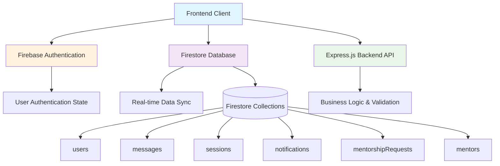
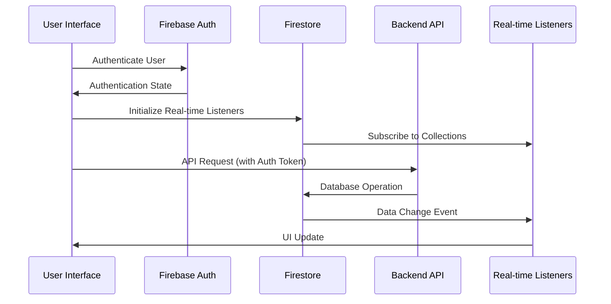

# Design Document: Firebase Firestore Integration

## Overview

This design document outlines the architecture for integrating Firebase Firestore into the MentorBridge platform, transforming it from a demo application with local storage into a fully functional mentorship platform with real-time data persistence, user authentication, and cloud synchronization.

The integration will replace the current local JavaScript array storage (`CONVS` array in chat.js) and demo authentication system with Firebase Authentication and Firestore real-time database. This transformation enables persistent user sessions, real-time messaging, cross-device synchronization, and scalable data management.

## Architecture

### High-Level Architecture



### Data Flow Architecture



## Components and Interfaces

### 1. Firebase Authentication Integration

**Purpose**: Replace demo authentication system with secure Firebase Authentication

**Component Structure**:
- **firebase-auth.js**: Enhanced authentication service layer
- **Authentication State Manager**: Handles login/logout/registration flows
- **User Session Manager**: Maintains persistent authentication state

**Key Interfaces**:

```javascript
// Enhanced Firebase Auth Interface
interface AuthService {
  // Core authentication methods
  signInUser(email: string, password: string, role: string): Promise<UserCredential>
  registerUser(email: string, password: string, role: string): Promise<UserCredential>
  signOutUser(): Promise<void>
  observeAuthState(callback: (user: User | null) => void): Unsubscribe
  
  // Password management
  sendPasswordResetEmail(email: string): Promise<void>
  sendEmailVerification(user: User): Promise<void>
  
  // State management
  getCurrentUser(): User | null
  isAuthenticated(): boolean
  getUserRole(): string | null
}

// User Profile Integration
interface ProfileService {
  createUserProfile(user: User, profileData: UserProfile): Promise<void>
  getUserProfile(uid: string): Promise<UserProfile>
  updateUserProfile(uid: string, updates: Partial<UserProfile>): Promise<void>
  observeUserProfile(uid: string, callback: (profile: UserProfile) => void): Unsubscribe
}
```

### 2. Firestore Database Service Layer

**Purpose**: Provide abstraction layer for all Firestore operations with type safety and error handling

**Component Structure**:
- **firestore-service.js**: Main database service
- **Collection Managers**: Specialized managers for each data type
- **Query Builders**: Optimized query construction and caching

**Key Interfaces**:

```javascript
// Main Firestore Service Interface
interface FirestoreService {
  // Collection access methods
  getCollection(name: string): CollectionReference
  getDocument(path: string): DocumentReference
  
  // Batch operations
  createBatch(): WriteBatch
  runTransaction(callback: (transaction: Transaction) => Promise<any>): Promise<any>
  
  // Real-time subscriptions
  subscribeToCollection(path: string, callback: (snapshot: QuerySnapshot) => void): Unsubscribe
  subscribeToDocument(path: string, callback: (snapshot: DocumentSnapshot) => void): Unsubscribe
  
  // Offline support
  enableOfflinePersistence(): Promise<void>
  clearOfflineData(): Promise<void>
}

// Specialized Collection Managers
interface MessageManager {
  sendMessage(conversationId: string, message: Message): Promise<DocumentReference>
  getConversationMessages(conversationId: string, limit?: number): Promise<Message[]>
  markMessagesAsRead(conversationId: string, userId: string): Promise<void>
  subscribeToConversation(conversationId: string, callback: (messages: Message[]) => void): Unsubscribe
}

interface SessionManager {
  createSession(sessionData: SessionBooking): Promise<DocumentReference>
  updateSessionStatus(sessionId: string, status: string): Promise<void>
  getUpcomingSessions(userId: string): Promise<SessionBooking[]>
  preventDoubleBooking(mentorId: string, date: Date, time: string): Promise<boolean>
}

interface NotificationManager {
  createNotification(notification: Notification): Promise<DocumentReference>
  markAsRead(notificationId: string, userId: string): Promise<void>
  getUserNotifications(userId: string): Promise<Notification[]>
  subscribeToUserNotifications(userId: string, callback: (notifications: Notification[]) => void): Unsubscribe
}
```

### 3. Real-Time Messaging System

**Purpose**: Replace local CONVS array with Firestore real-time messaging

**Component Structure**:
- **messaging-service.js**: Real-time messaging coordination
- **conversation-manager.js**: Conversation state management
- **message-ui-controller.js**: UI synchronization with Firestore

**Implementation Strategy**:

```javascript
// Real-time Messaging Architecture
class MessagingService {
  constructor(firestoreService, authService) {
    this.db = firestoreService;
    this.auth = authService;
    this.activeSubscriptions = new Map();
  }
  
  // Subscribe to conversation updates
  subscribeToConversation(conversationId) {
    const unsubscribe = this.db.subscribeToCollection(
      `conversations/${conversationId}/messages`,
      (snapshot) => {
        const messages = snapshot.docs.map(doc => ({
          id: doc.id,
          ...doc.data(),
          timestamp: doc.data().timestamp.toDate()
        }));
        this.updateConversationUI(conversationId, messages);
      }
    );
    
    this.activeSubscriptions.set(conversationId, unsubscribe);
    return unsubscribe;
  }
  
  // Send message with real-time updates
  async sendMessage(conversationId, messageText) {
    const message = {
      senderId: this.auth.getCurrentUser().uid,
      senderName: this.auth.getCurrentUser().displayName,
      text: messageText,
      timestamp: firebase.firestore.FieldValue.serverTimestamp(),
      readBy: [this.auth.getCurrentUser().uid],
      conversationId
    };
    
    await this.db.getCollection('messages').add(message);
    
    // Update conversation metadata
    await this.updateConversationMetadata(conversationId, message);
  }
  
  // Cleanup subscriptions
  unsubscribeFromConversation(conversationId) {
    const unsubscribe = this.activeSubscriptions.get(conversationId);
    if (unsubscribe) {
      unsubscribe();
      this.activeSubscriptions.delete(conversationId);
    }
  }
}
```

### 4. User Profile Management

**Purpose**: Integrate user profiles with Firestore for persistent, synchronized profile data

**Component Structure**:
- **profile-service.js**: Profile data management
- **role-manager.js**: Role-based access control
- **profile-ui-sync.js**: UI synchronization with profile data

**Profile Data Model**:

```javascript
// User Profile Schema
interface UserProfile {
  uid: string;
  email: string;
  role: 'student' | 'mentor' | 'admin';
  
  // Personal Information
  name: string;
  programme?: string;
  level?: string;
  bio?: string;
  
  // Professional Information (for mentors)
  company?: string;
  position?: string;
  yearsExperience?: number;
  expertise?: string[];
  industries?: string[];
  
  // Student Information
  careerField?: string;
  skills?: string[];
  interests?: string[];
  careerGoals?: string[];
  
  // Profile Management
  profileComplete: boolean;
  lastUpdated: Timestamp;
  createdAt: Timestamp;
  
  // Preferences
  availability?: string;
  languages?: string[];
  notificationPreferences: {
    email: boolean;
    push: boolean;
    sessions: boolean;
    messages: boolean;
  };
}
```

### 5. Session Management Integration

**Purpose**: Replace in-memory session arrays with Firestore-backed session management

**Session Data Model**:

```javascript
interface SessionBooking {
  id: string;
  studentId: string;
  mentorId: string;
  
  // Session Details
  title: string;
  type: 'career-advice' | 'mock-interview' | 'technical-review' | 'networking' | 'other';
  date: Timestamp;
  duration: number; // minutes
  status: 'pending' | 'accepted' | 'declined' | 'completed' | 'cancelled';
  
  // Participants
  participants: {
    student: {
      id: string;
      name: string;
      programme: string;
    };
    mentor: {
      id: string;
      name: string;
      company: string;
    };
  };
  
  // Session Content
  studentMessage: string;
  mentorNotes?: string;
  sessionOutcome?: string;
  
  // Timestamps
  createdAt: Timestamp;
  updatedAt: Timestamp;
  scheduledFor: Timestamp;
}
```

### 6. Real-Time Notification System

**Purpose**: Implement comprehensive real-time notifications for all platform events

**Notification Architecture**:

```javascript
// Notification Types and Triggers
enum NotificationType {
  MESSAGE_RECEIVED = 'message_received',
  SESSION_REQUESTED = 'session_requested',
  SESSION_ACCEPTED = 'session_accepted',
  SESSION_DECLINED = 'session_declined',
  SESSION_REMINDER = 'session_reminder',
  PROFILE_UPDATE = 'profile_update',
  SYSTEM_ANNOUNCEMENT = 'system_announcement'
}

interface Notification {
  id: string;
  userId: string;
  type: NotificationType;
  title: string;
  message: string;
  
  // Metadata
  relatedEntityId?: string; // sessionId, messageId, etc.
  relatedEntityType?: string;
  actionUrl?: string;
  
  // State
  read: boolean;
  readAt?: Timestamp;
  createdAt: Timestamp;
  
  // Display
  priority: 'low' | 'medium' | 'high';
  iconType: string;
}

// Notification Service
class NotificationService {
  async createNotification(notification: Partial<Notification>) {
    const notificationDoc = {
      ...notification,
      id: this.generateId(),
      createdAt: firebase.firestore.FieldValue.serverTimestamp(),
      read: false
    };
    
    await this.db.collection('notifications').add(notificationDoc);
    
    // Update user's unread count
    await this.updateUnreadCount(notification.userId);
  }
  
  subscribeToUserNotifications(userId: string, callback: Function) {
    return this.db.collection('notifications')
      .where('userId', '==', userId)
      .orderBy('createdAt', 'desc')
      .limit(50)
      .onSnapshot(callback);
  }
}
```

## Data Models

### Firestore Collection Schema

#### Users Collection
```javascript
// Collection: /users/{userId}
{
  uid: string,
  email: string,
  role: 'student' | 'mentor' | 'admin',
  name: string,
  programme?: string,
  level?: string,
  bio?: string,
  company?: string,
  position?: string,
  yearsExperience?: number,
  expertise?: string[],
  industries?: string[],
  careerField?: string,
  skills?: string[],
  interests?: string[],
  careerGoals?: string[],
  profileComplete: boolean,
  availability?: string,
  languages?: string[],
  notificationPreferences: object,
  createdAt: Timestamp,
  lastUpdated: Timestamp
}
```

#### Messages Collection
```javascript
// Collection: /messages/{messageId}
{
  conversationId: string,
  senderId: string,
  senderName: string,
  text: string,
  timestamp: Timestamp,
  readBy: string[], // Array of user IDs who have read this message
  messageType: 'text' | 'system' | 'file',
  edited?: boolean,
  editedAt?: Timestamp
}

// Subcollection: /conversations/{conversationId}/metadata
{
  participants: string[], // Array of user IDs
  lastMessage: {
    text: string,
    timestamp: Timestamp,
    senderId: string
  },
  unreadCounts: {
    [userId]: number
  },
  createdAt: Timestamp,
  updatedAt: Timestamp
}
```

#### Sessions Collection
```javascript
// Collection: /sessions/{sessionId}
{
  studentId: string,
  mentorId: string,
  title: string,
  type: string,
  date: Timestamp,
  duration: number,
  status: string,
  participants: object,
  studentMessage: string,
  mentorNotes?: string,
  sessionOutcome?: string,
  createdAt: Timestamp,
  updatedAt: Timestamp,
  scheduledFor: Timestamp
}
```

#### Mentorship Requests Collection
```javascript
// Collection: /mentorshipRequests/{requestId}
{
  studentId: string,
  mentorId: string,
  studentName: string,
  mentorName: string,
  message: string,
  status: 'pending' | 'accepted' | 'declined',
  requestType: string,
  createdAt: Timestamp,
  respondedAt?: Timestamp,
  mentorResponse?: string
}
```

#### Notifications Collection
```javascript
// Collection: /notifications/{notificationId}
{
  userId: string,
  type: string,
  title: string,
  message: string,
  relatedEntityId?: string,
  relatedEntityType?: string,
  actionUrl?: string,
  read: boolean,
  readAt?: Timestamp,
  createdAt: Timestamp,
  priority: string,
  iconType: string
}
```

### Database Indexes and Performance Optimization

#### Required Composite Indexes
```javascript
// Messages collection indexes
messages: [
  ['conversationId', 'timestamp'],
  ['senderId', 'timestamp'],
  ['readBy', 'timestamp']
]

// Sessions collection indexes
sessions: [
  ['studentId', 'scheduledFor'],
  ['mentorId', 'scheduledFor'],
  ['status', 'scheduledFor'],
  ['participants.student.id', 'createdAt'],
  ['participants.mentor.id', 'createdAt']
]

// Notifications collection indexes
notifications: [
  ['userId', 'createdAt'],
  ['userId', 'read', 'createdAt'],
  ['type', 'createdAt']
]

// Mentorship requests indexes
mentorshipRequests: [
  ['studentId', 'createdAt'],
  ['mentorId', 'status', 'createdAt'],
  ['status', 'createdAt']
]
```

## Correctness Properties

*A property is a characteristic or behavior that should hold true across all valid executions of a system—essentially, a formal statement about what the system should do. Properties serve as the bridge between human-readable specifications and machine-verifiable correctness guarantees.*

### Property 1: User Registration and Profile Creation

*For any* valid email and password combination, user registration SHALL create both a Firebase user account and a corresponding Firestore User_Profile document with consistent data.

**Validates: Requirements 1.2, 3.1**

### Property 2: Authentication Error Handling

*For any* invalid credential combination (malformed emails, weak passwords, non-existent accounts), the authentication system SHALL reject access and return descriptive, user-friendly error messages.

**Validates: Requirements 1.3, 1.5**

### Property 3: UI Authentication State Synchronization

*For any* authentication state change (login, logout, token refresh), the MentorBridge system SHALL update the UI navigation and available features immediately to reflect the current user's permissions and role.

**Validates: Requirements 1.7, 3.5**

### Property 4: Message Persistence and Real-time Delivery

*For any* message sent by a user, the message SHALL be persisted to Firestore immediately and delivered to all conversation participants through real-time listeners within the specified time bounds.

**Validates: Requirements 2.2, 2.6**

### Property 5: Message Ordering Consistency

*For any* sequence of messages in a conversation, the system SHALL maintain consistent chronological ordering by server timestamp across all devices and sessions.

**Validates: Requirements 2.4**

### Property 6: Read Status Management

*For any* conversation accessed by a user, opening the conversation SHALL mark all unread messages as read and update the read status for all participants in real-time.

**Validates: Requirements 2.5**

### Property 7: Profile Data Integrity and Updates

*For any* user profile modification, the changes SHALL be immediately persisted to Firestore and reflected across all user sessions while maintaining data structure completeness (required fields present).

**Validates: Requirements 3.2, 3.3**

### Property 8: Role-Based Access Control

*For any* user attempting to modify profile data, the system SHALL enforce role-based permissions where users can only modify their own profiles and admins can modify any profile.

**Validates: Requirements 3.4, 6.1, 6.2**

### Property 9: Session Booking Integrity

*For any* session booking creation or modification, the system SHALL update all participant calendars immediately and prevent double-booking conflicts through Firestore transaction mechanisms.

**Validates: Requirements 4.2, 4.4**

### Property 10: Session Status Management

*For any* session status change (pending → accepted, accepted → completed), the system SHALL update the session document and trigger appropriate notifications for all participants.

**Validates: Requirements 4.5**

### Property 11: Notification Creation and Delivery

*For any* significant platform event (message sent, session booked, profile updated), the system SHALL create appropriate notification documents in Firestore and deliver them to affected users' interfaces.

**Validates: Requirements 5.1, 5.2**

### Property 12: Notification Read Status Synchronization

*For any* notification marked as read by a user, the read status SHALL be updated across all user devices and sessions, with notification badge counts reflecting the current unread state.

**Validates: Requirements 5.4, 5.5**

### Property 13: Security Access Control Enforcement

*For any* database operation attempt, the Firestore security rules SHALL enforce role-based permissions, restricting message access to conversation participants and rejecting unauthorized access attempts.

**Validates: Requirements 6.1, 6.2, 6.3**

### Property 14: Audit Logging Completeness

*For any* data access or modification operation performed by users, the system SHALL log the operation details for security monitoring and audit trail purposes.

**Validates: Requirements 6.6**

### Property 15: Matching Data Management

*For any* mentor-student profile combination, the system SHALL calculate and persist compatibility scores in Firestore, creating relationship documents when connections are established.

**Validates: Requirements 7.2, 7.4**

### Property 16: Matching Data Persistence

*For any* mentor availability, expertise area, or student preference update, the system SHALL maintain the data in persistent Firestore storage and preserve matching history for analytics.

**Validates: Requirements 7.3, 7.6**

### Property 17: Sync Conflict Resolution

*For any* conflicting offline changes that sync when connectivity resumes, the system SHALL resolve conflicts by preserving the most recent changes based on server timestamps.

**Validates: Requirements 8.4**

### Property 18: Network Status UI Indication

*For any* network connectivity change (online ↔ offline), the system SHALL clearly indicate the network status to users and show appropriate UI states.

**Validates: Requirements 8.5**

### Property 19: Query Optimization and Pagination

*For any* large dataset query (conversations with many messages, user lists), the system SHALL implement pagination to limit initial data retrieval and load additional data on demand.

**Validates: Requirements 9.1, 9.3**

### Property 20: Data Caching Consistency

*For any* frequently accessed data, the system SHALL maintain local caching while ensuring real-time synchronization with Firestore updates.

**Validates: Requirements 9.5**

### Property 21: Data Migration Integrity

*For any* existing local storage data (demo users, messages, sessions), the migration process SHALL preserve all data when transferring to Firestore collections while maintaining data completeness and structure.

**Validates: Requirements 10.1, 10.2, 10.5**

### Property 22: Migration User Account Creation

*For any* demo user account during migration, the system SHALL create corresponding Firebase Authentication accounts while preserving user identity and role information.

**Validates: Requirements 10.3**

### Property 23: API Compatibility During Migration

*For any* API endpoint during migration, the system SHALL maintain backward compatibility to prevent frontend disruption while transitioning from local storage to Firestore data sources.

**Validates: Requirements 10.4**

## Error Handling

### Authentication Errors
- **Invalid Credentials**: Clear error messages for wrong email/password combinations
- **Network Failures**: Graceful degradation with retry mechanisms
- **Email Verification**: User-friendly prompts for unverified accounts
- **Password Reset**: Clear feedback for password reset email delivery

### Firestore Operation Errors
- **Connection Failures**: Automatic retry with exponential backoff
- **Permission Denied**: Clear error messages with suggested actions
- **Quota Exceeded**: User notification with retry suggestions
- **Data Validation**: Client-side validation with server-side verification

### Real-Time Listener Errors
- **Subscription Failures**: Automatic reconnection with fallback to polling
- **Network Interruptions**: Seamless transition to offline mode
- **Memory Management**: Automatic cleanup of unused subscriptions

### Data Consistency Errors
- **Write Conflicts**: Transaction retry mechanisms with conflict resolution
- **Stale Data**: Automatic refresh with user notification
- **Migration Errors**: Rollback mechanisms with data integrity checks

## Testing Strategy

### Unit Testing Approach
- **Authentication Service Tests**: Verify login/logout flows and error handling
- **Firestore Service Tests**: Mock Firestore operations for data layer testing
- **UI Component Tests**: Test React components with mocked Firebase services
- **Validation Logic Tests**: Verify data validation and sanitization

### Integration Testing Approach
- **Firebase Auth Integration**: Test actual authentication flows with Firebase
- **Firestore Integration**: Verify database operations against Firestore emulator
- **Real-time Listener Testing**: Test subscription behavior and cleanup
- **Cross-browser Compatibility**: Ensure Firebase SDK works across browsers

### Property-Based Testing Configuration
- **Testing Library**: Use fast-check.js for JavaScript property-based testing
- **Test Configuration**: Minimum 100 iterations per property test
- **Firebase Emulator**: Use Firebase emulator suite for isolated testing
- **Mock Strategy**: Mock external Firebase services for property tests, use real services for integration tests

Each property-based test will be tagged with:
**Feature: firebase-firestore-integration, Property {number}: {property_text}**

### End-to-End Testing
- **User Journey Tests**: Complete authentication and messaging flows
- **Multi-device Testing**: Verify real-time synchronization across devices
- **Offline/Online Testing**: Test offline persistence and sync behavior
- **Performance Testing**: Verify real-time update latency requirements